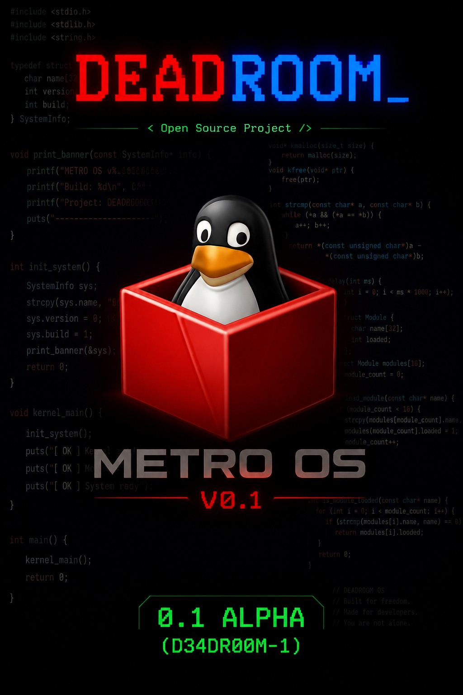

# METRO-OS
### VERSION 0.1 — BUILD ID: D34DR00M-1

A lightweight 32-bit x86 operating system project that boots from an ISO image using GRUB, written in C and x86 Assembly.

---

## Poster



---

## PROGRAMER


---

## Project Information

### What is METRO-OS?
METRO-OS is an experimental operating system project designed for learning and exploration. It boots with GRUB through the Multiboot protocol and presents a simple shell environment inside a custom VGA console.

### Current Features
- GRUB-based boot flow
- Custom boot splash screen with DEADROOM ASCII art
- VGA text mode output
- PS/2 keyboard input
- Built-in shell commands:
  - `help`
  - `cls`
  - `ver`
  - `mem`
  - `time`
  - `cpuinfo`
  - `shutdown`
  - `copy`
  - `dir`
  - `cd`
  - `cat`
  - `echo`
  - `touch`
  - `mkdir`
  - `rmdir`
  - `rm`
  - `restart`
  - `cmdlocate`

### Project Structure
```text
METRO-OS/
├── boot/boot.asm           # Multiboot entry and boot assembly
├── kernel/kernel.c         # Splash screen, shell loop, command dispatcher
├── drivers/
│   ├── vga.c / vga.h       # VGA text-mode output
│   └── keyboard.c / .h     # Keyboard input handling
├── commands/
│   ├── cmd_mem.c           # Memory command
│   ├── cmd_time.c          # RTC time command
│   ├── cmd_copy.c          # Text echo command
│   └── sys_cmd.c           # Shell commands and system actions
├── linker.ld               # Linker script
├── grub.cfg                # GRUB menu configuration
└── Makefile                # Build system
```

### Build and Run
Requirements:
- `nasm`
- `gcc` (32-bit support)
- `grub-mkrescue`
- `qemu-system-i386`

Commands:
```bash
make
make iso
make run
make clean
```

### System Requirements
- Architecture: x86 / 32-bit
- RAM: 128 MB minimum
- Boot mode: GRUB Multiboot

---

## License
```Licence
MIT License

Copyright (c) DEADROOM OPEN SOURCE PROJECT 2026

Permission is hereby granted, free of charge, to any person obtaining a copy
of this software and associated documentation files (the "Software"), to deal
in the Software without restriction, including without limitation the rights
to use, copy, modify, merge, publish, distribute, sublicense, and/or sell
copies of the Software, and to permit persons to whom the Software is
furnished to do so, subject to the following conditions:

The above copyright notice and this permission notice shall be included in all
copies or substantial portions of the Software.

THE SOFTWARE IS PROVIDED "AS IS", WITHOUT WARRANTY OF ANY KIND, EXPRESS OR
IMPLIED, INCLUDING BUT NOT LIMITED TO THE WARRANTIES OF MERCHANTABILITY,
FITNESS FOR A PARTICULAR PURPOSE AND NONINFRINGEMENT. IN NO EVENT SHALL THE
AUTHORS OR COPYRIGHT HOLDERS BE LIABLE FOR ANY CLAIM, DAMAGES OR OTHER
LIABILITY, WHETHER IN AN ACTION OF CONTRACT, TORT OR OTHERWISE, ARISING FROM,
OUT OF OR IN CONNECTION WITH THE SOFTWARE OR THE USE OR OTHER DEALINGS IN THE
SOFTWARE.


---
